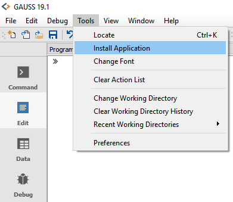
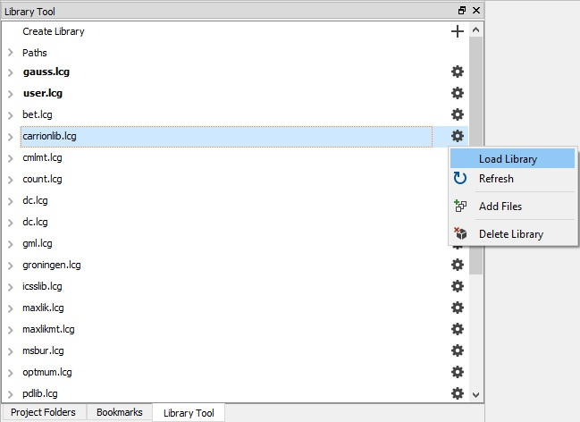

# chopitlib
 This repository contains the GAUSS CHOPITLIIB library developed by [Mark Harris](https://staffportal.curtin.edu.au/staff/profile/view/Mark.Harris/).

When using this code, please cite:
 Greene, W.H., Harris, M.N., Knott, R. and Rice, N., 2020 (forthcoming); Specification and testing of hierarchical ordered response models with anchoring vignettes, *Journal of the Royal Statistical Society*, Series A (accepted 19-Jun-2020).

 ## What is GAUSS?
  [**GAUSS**](www.aptech.com) is an easy-to-use data analysis, mathematical and statistical environment based on the powerful, fast and efficient **GAUSS Matrix Programming Language**. [**GAUSS**](www.aptech.com) is a complete analysis environment with the built-in tools you need for estimation, forecasting, simulation, visualization and more.

  ## What is the GAUSS CHOPIT library?
  The [**GAUSS**](www.aptech.com) **CHOPITLIB** library is a collection of [**GAUSS**](www.aptech.com) code developed by [Mark Harris](https://staffportal.curtin.edu.au/staff/profile/view/Mark.Harris/).

  The chopitlib library implements the Compound Hierarchical Ordered Probit (CHOPIT) model. When used in conjunction with anchoring vignette questions, the CHOPIT model allows researchers to adjust for reporting heterogeneity in self-assessed survey questions.  

  This code:
  *  Estimates the CHOPIT model with anchoring techniques.
  *  Implements a new parametric test for the underlying assumptions of the CHOPIT analysis with vignettes.

  ## Getting Started
  ### Installing
  **GAUSS 20+**
  The GAUSS CHOPITLIB library can be installed and updated directly in GAUSS using the [GAUSS package manager](https://www.aptech.com/blog/gauss-package-manager-basics/).

  **GAUSS 18+**
  The GAUSS CHOPITLIB library can be easily installed using the [**GAUSS Application Installer**](https://www.aptech.com/support/installation/using-the-applications-installer-wizard/), as shown below:

  1. Download the zipped folder `chopit_0.1.0.zip` from the [CHOPIT Library Release page](https://github.com/aptech/chopitlib/releases).
  2. Select **Tools > Install Application** from the main **GAUSS** menu.  
    

  3. Follow the installer prompts, making sure to navigate to the downloaded `chopitlib_0.1.0.zip`.
  4. Before using the functions created by `chopitlib` you will need to load the newly created `chopitlib` library. This can be done in a number of ways:
    *   Navigate to the **Library Tool Window** and click the small wrench located next to the `chopitlib` library. Select `Load Library`.  
    
    *  Enter `library chopitlib` in the **Program Input/output Window**.
    *  Put the line `library chopitlib;` at the beginning of your program files.

  >Note: I have provided the individual files found in `chopitlib_0.1.0.zip` for examination and review. However, installation should always be done using the [`chopitlib_0.1.0.zip` from the release page](https://github.com/aptech/chopitlib/releases) and the [**GAUSS Application Installer**](https://www.aptech.com/support/installation/using-the-applications-installer-wizard/).

  ## Authors
  [Mark Harris](mailto:Mark.Harris@curtin.edu.au)
  [Erica Clower](mailto:erica@aptech.com)  
  [Aptech Systems, Inc](https://www.aptech.com/)  
  [![alt text][1.1]][1]
  [![alt text][2.1]][2]
  [![alt text][3.1]][3]

  <!-- links to social media icons -->
  [1.1]: https://www.aptech.com/wp-content/uploads/2019/02/fb.png (Visit Aptech Facebook)
  [2.1]: https://www.aptech.com/wp-content/uploads/2019/02/gh.png (Aptech Github)
  [3.1]: https://www.aptech.com/wp-content/uploads/2019/02/li.png (Find us on LinkedIn)

  <!-- links to your social media accounts -->
  [1]: https://www.facebook.com/GAUSSAptech/
  [2]: https://github.com/aptech
  [3]: https://linkedin.com/in/ericaclower
  <!-- Please don't remove this: Grab your social icons from https://github.com/carlsednaoui/gitsocial -->
